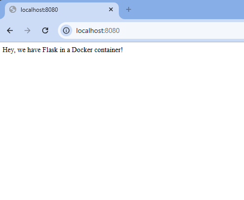

# Dockerized Flask Web App

A simple Flask web application running inside a Docker container. This project involves containerizing a Python web app and running it on a custom port to avoid conflicts in a shared environment.

## Tutorial Reference
This project follows a tutorial (archived version) from [Runnable.com](https://runnable.com/docker/python/dockerize-your-flask-application).

## Project Goal
- Practice containerizing a Python web app with Docker  
- Learn how to run the app on a custom port in a shared environment  

## Webpage Screenshot
The Flask webpage displays a message confirming the app is running correctly inside

